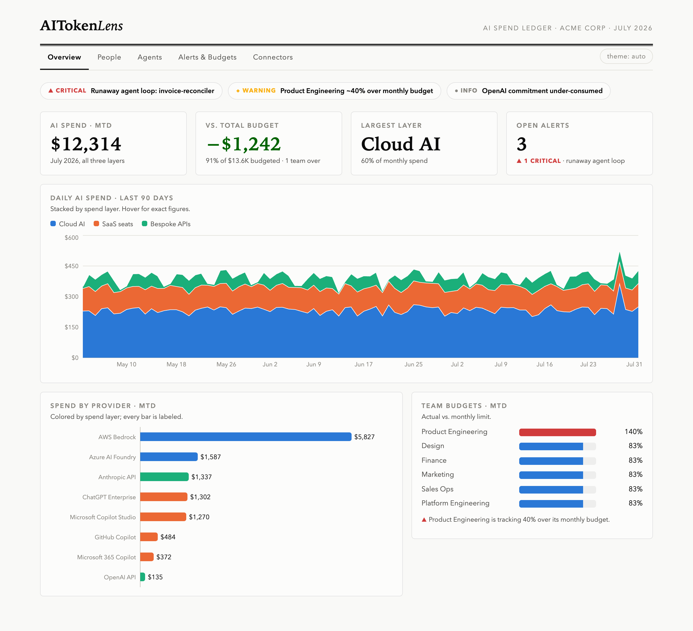
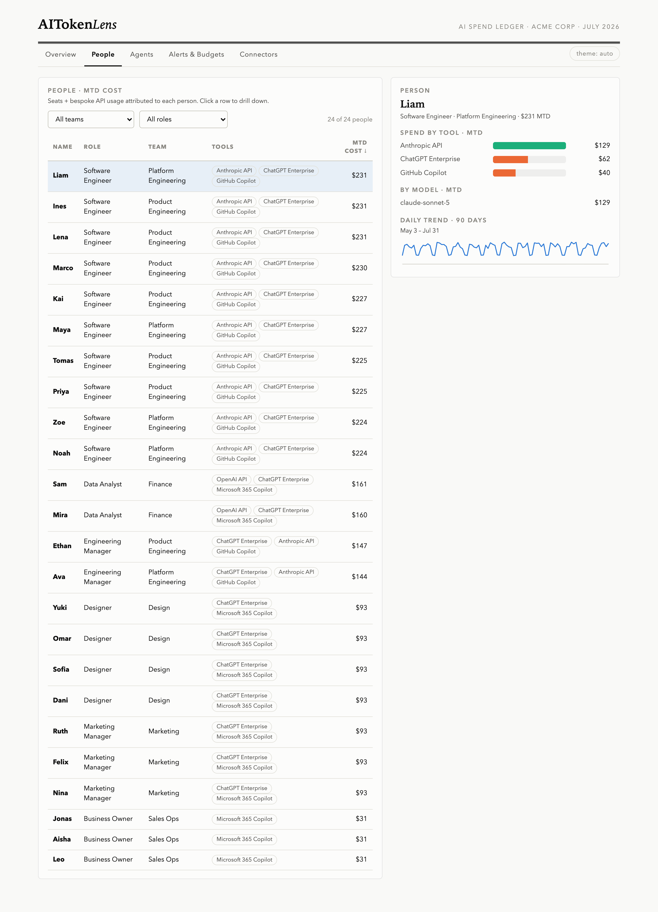
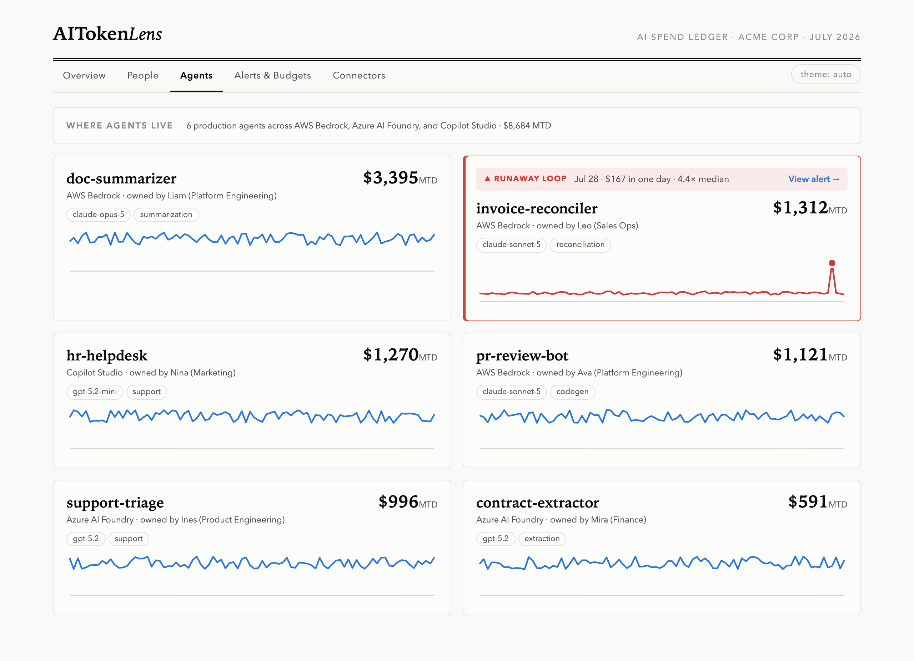
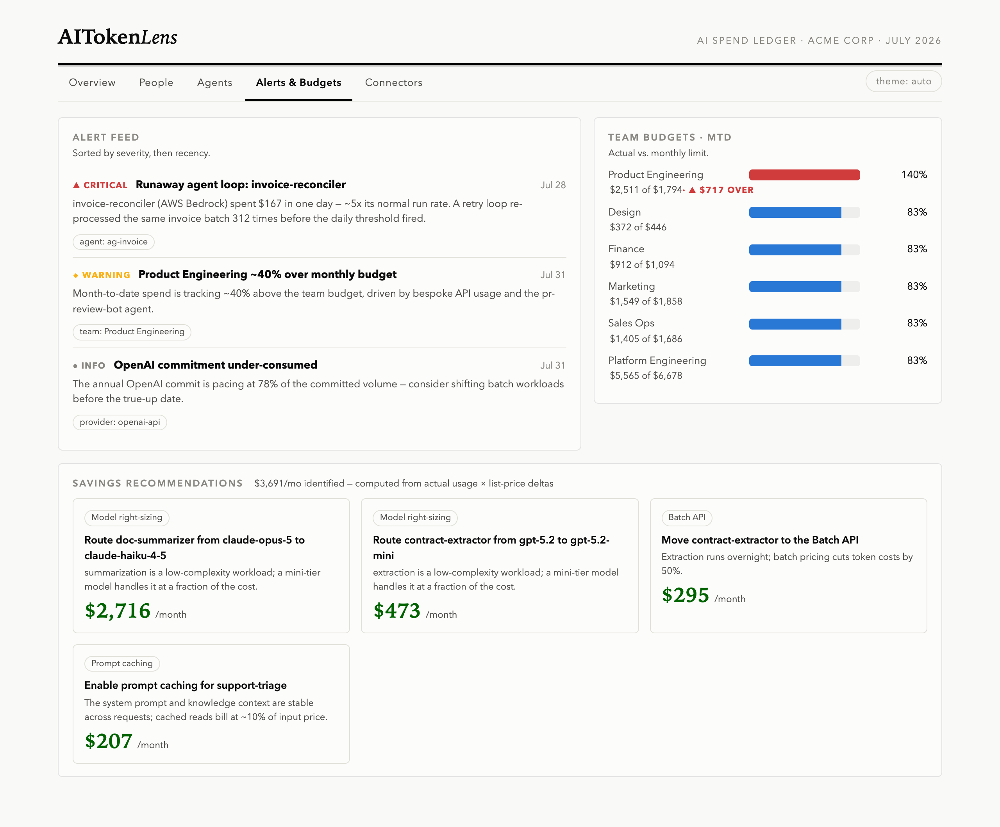
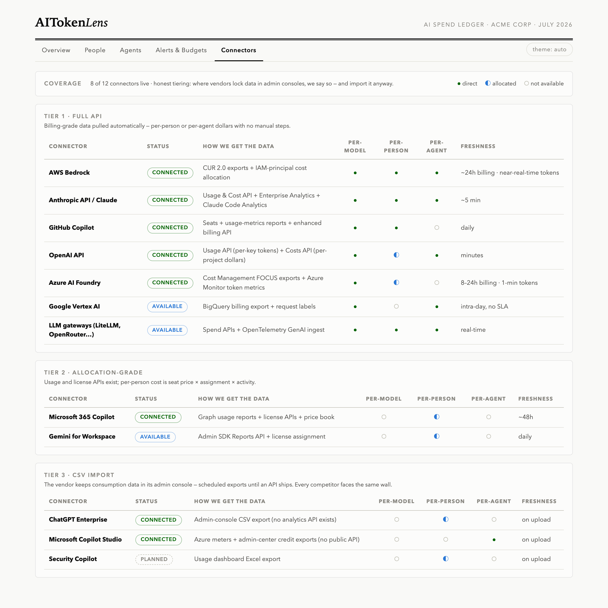
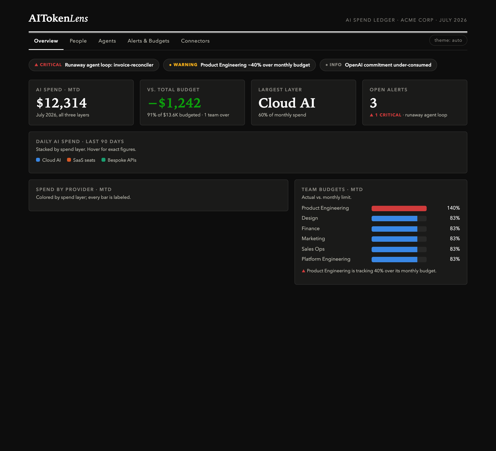

# AITokenLens

**Prototype** — a centralized AI spend & token-cost tracking dashboard for CFOs and finance teams.

One place to see AI costs across all three spend layers:

1. **Cloud AI** — AWS Bedrock, Azure AI Foundry, Google Vertex
2. **SaaS AI seats** — ChatGPT Enterprise, Microsoft 365 Copilot, GitHub Copilot
3. **Bespoke apps & agents** — direct OpenAI/Anthropic API usage, gateways, agent runtimes

…with per-person and per-agent attribution, budgets, anomaly alerts, and model-choice savings recommendations.

> Demo prototype: deterministic mock data, no credentials, no backend. The demo narrative is *"the surprise bill you caught in time."*



## Run it

```bash
npm install
npm run dev
```

Open http://localhost:5173. `npm test` runs the 15-test suite; `npm run build` produces a static bundle.

## The 5-minute demo script

Walk the five tabs in order — the seeded data tells one story: **a runaway agent
loop was caught before the invoice arrived.**

| Step | View | What to show | The one-liner |
|---|---|---|---|
| 1 | **Overview** | The alert ticker and the spike on July 28 in the 90-day trend | "Every AI dollar — cloud, seats, and API keys — in one ledger. See that spike?" |
| 2 | **Overview** (lower) | Provider bars + team budgets | "AWS Bedrock is 47% of spend, and Product Engineering is 140% of budget — we knew on day 3, not at invoice time." |
| 3 | **Agents** | The red `invoice-reconciler` card | "This agent re-processed the same invoice batch 312 times in one night — 4.4× its normal day. The anomaly threshold caught it." |
| 4 | **Alerts & Budgets** | The savings recommendations | "And it's not just alarms — routing one summarization agent to a mini-tier model saves $2.7K/month. $3.7K/month identified in total, computed from real usage × list prices." |
| 5 | **People** | Filter by team, click a person | "Every seat and every API key rolls up to a person — this is the per-person attribution nobody else has across all three layers." |
| 6 | **Connectors** | The three tiers | "We're honest about where vendors lock data in admin consoles — and we import it anyway. Everyone faces the same wall; we productized the workaround." |

Bonus: click **theme** (top right) to show the dark mode — same validated palette, restepped for dark surfaces.

## The five views

| | |
|---|---|
|  |  |
|  |  |



## Live Anthropic connector (M5)

The first real connector: pull your organization's actual Anthropic usage and
cost via the [Admin Usage & Cost API](https://platform.claude.com/docs/en/manage-claude/usage-cost-api)
and overlay it on the dashboard.

```bash
# 1. Create an Admin API key in the Anthropic Console
#    (Settings → Organization → API keys — requires the admin role)
# 2. Fetch a 30-day snapshot (the key stays in your env; never written to disk):
ANTHROPIC_ADMIN_KEY=sk-ant-admin-... node scripts/fetch-anthropic.mjs
# 3. Reload the dashboard — a "live · anthropic" badge appears and the
#    Anthropic API provider now shows your real spend.
```

Daily costs are **reconciled to the billed cost report** (records are scaled so
each day sums exactly to what Anthropic billed); without a cost report the app
falls back to tokens × list price. Snapshots live in `public/live/` (gitignored).

## How it's built

- **Vite + React + TypeScript**, Recharts for the stacked trend and provider bars.
- **Deterministic seeded dataset** ([src/data/generate.ts](src/data/generate.ts)) — 90 days, 24 people, 6 agents, ~5,850 records. Three story beats are seeded *and test-enforced*: the runaway loop (day −3, >3× median), one team ~40% over budget, and a right-sizing opportunity ≥$2.5K/mo. Anthropic model prices are real list prices; other vendors' are plausible mocks.
- **Recommendations are computed, never hardcoded** — savings come from actual mock usage × list-price deltas (`computeRecommendations` in [src/data/generate.ts](src/data/generate.ts)).
- **Theme** — light/dark from a CVD-validated categorical palette; the three spend layers map to fixed palette slots.
- **Screenshots** — `node scripts/screenshots.mjs` captures all views headless via the local Chrome.

## Status

Built milestone-by-milestone via [issues](../../issues) and [PRs](../../pulls); design doc in [docs/design.md](docs/design.md). The dashboard is a demo of the product vision documented in the accompanying research report (market validation, competitor pricing, and the API integration map behind the Connectors tiers).
